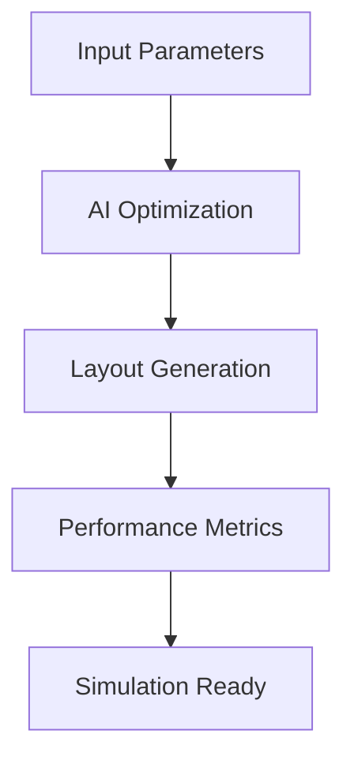

## Overview

zapRF streamlines MMIC power amplifier design by automating layout generation with AI. You define key parameters like frequency range and power output, and zapRF delivers optimized layouts in hours. This guide walks you through the process, from inputs to iterations and best practices for RF workflows.

<Columns cols={3}>
  <Card title="Faster Design" icon="zap" href="#">
    Reduce timelines from weeks to hours with AI automation.
  </Card>
  <Card title="Cost Savings" icon="dollar-sign" href="#">
    Minimize manual iterations and engineering costs.
  </Card>
  <Card title="Optimized Layouts" icon="settings" href="#">
    Achieve superior performance for MMIC amplifiers.
  </Card>
</Columns>

## Define Input Parameters

Start by specifying parameters for your power amplifier. Use the zapRF dashboard to input values such as target frequency, output power, and transistor sizes.

| Parameter | Type | Required | Description |
|-----------|------|----------|-------------|
| `frequency` | number (GHz) | Yes | Center frequency, e.g., `5.8` |
| `power_output` | number (dBm) | Yes | Target output power, e.g., `30` |
| `transistor_width` | number (um) | No | Gate width per finger, default `100` |
| `stages` | number | No | Number of amplification stages, default `2` |

<Callout kind="tip">
  Validate your inputs early. Frequencies `<1GHz` or `>100GHz` may require custom models.
</Callout>

## Generate and Interpret Optimizations

Submit your parameters to trigger AI optimization. zapRF analyzes matching networks, bias lines, and stability circuits.



<Tabs>
  <Tab title="Layout View" icon="eye">
    Review the generated S-parameters and layout in the viewer. Key metrics include gain `>15dB` and PAE `>40%`.
  </Tab>
  <Tab title="Metrics Table" icon="bar-chart">
    | Metric | Value | Target |
    |--------|-------|--------|
    | Gain | `18.2dB` | `>15dB` |
    | PAE | `45%` | `>40%` |
    | Stability | `1.2` | `<2.0` |
  </Tab>
</Tabs>

## Iterate Designs with Simulations

Refine outputs by running simulations. Use the export feature to integrate with your tools.

<Steps>
  <Step title="Export Layout" icon="download">
    Download GDSII or OMM files from the dashboard.
  </Step>
  <Step title="Run EM Simulation" icon="zap">
    Import into your simulator. Example ADS script:
    
    <CodeGroup tabs="ADS,Keysight">
    ````ads
    Simulation-ADS {
      Freq[5.5GHz to 6.1GHz]
      EMSetup: emsim1
      S_Param
    }
    ````
    ````python
    # Keysight PathWave
    import pathwave
    sim = pathwave.Sim(freq_range=(5.5e9, 6.1e9))
    sim.run_em()
    ````
    </CodeGroup>
  </Step>
  <Step title="Feedback Loop" icon="refresh-cw">
    Upload simulation results back to zapRF for re-optimization.
  </Step>
</Steps>

## Advanced Customizations

<Expandable title="Custom Transistor Models" default-open="false">

Override defaults with your foundry PDK. Upload SPICE models via the advanced tab.

```json
{
  "transistor": {
    "model": "your_pdk.nmos",
    "width": 150,
    "fingers": 4
  },
  "constraints": {
    "max_gain": 20,
    "min_pae": 0.45
  }
}
```

</Expandable>

## RF-Specific Best Practices

- Prioritize stability: Always check K-factor `>1` across the band.
- Bias optimization: Use zapRF's automated T-lines for even current distribution.
- Thermal management: Enable heat sink modeling for high-power designs.

<Callout kind="alert">
  For frequencies `>60GHz`, enable mmWave mode to account for skin effect and parasitics.
</Callout>

Iterate 2-3 times for production-ready designs. zapRF cuts your MMIC cycle by 80%, letting you focus on innovation.