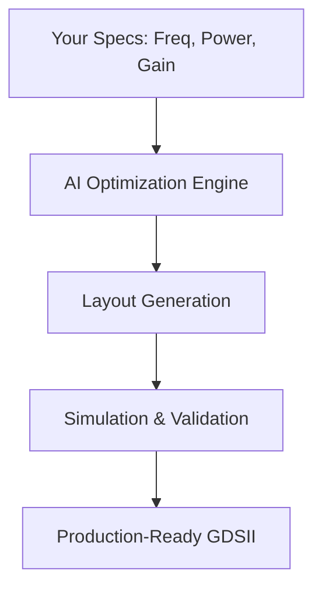

## Overview

zapRF revolutionizes RF design by automating the generation of optimized layouts for MMIC power amplifiers. You achieve production-ready designs in hours instead of weeks, cutting costs and accelerating your time-to-market. Powered by advanced AI, zapRF handles complex layout optimization, matching networks, and thermal management automatically.

<Columns cols={3}>
  <Card title="Lightning-Fast Design" icon="zap" href="/docs/quickstart">
    Generate layouts `<100` hours for complex PAs.
  </Card>
  <Card title="Cost Reduction" icon="trending-down" href="/docs/pricing">
    Save up to `70%` on design iterations and prototyping.
  </Card>
  <Card title="Proven Accuracy" icon="check-circle" href="/docs/case-studies">
    Matches expert designs with `<1dB` performance deviation.
  </Card>
</Columns>

<Callout kind="success">
  RF teams using zapRF report `3x` faster design cycles and `50%` fewer respins.
</Callout>

## Who Uses zapRF?

zapRF targets RF design engineers, MMIC specialists, and hardware teams in aerospace, telecom, defense, and 5G/6G development. You focus on innovation while zapRF automates tedious layout tasks like inductor placement, via optimization, and impedance matching.

## How zapRF Works

zapRF uses AI models trained on thousands of expert layouts to generate optimized designs from your specs.



<Expandable title="Deep Dive: AI Automation Process" default-open="false">

1. **Input Parsing**: Upload PDK, schematic, and constraints.
2. **Optimization**: AI explores millions of topologies using reinforcement learning.
3. **Validation**: Built-in EM simulation ensures performance targets.
4. **Export**: Get Gerber, GDSII, and reports instantly.

</Expandable>

## Get Started in Minutes

Follow these steps to create your first layout.

<Steps>
  <Step title="Sign Up" icon="user-plus">
    Create a free account at [app.zaprf.com](https://app.zaprf.com).
  </Step>
  <Step title="Upload Specs" icon="upload">
    Provide your PDK, netlist, and targets like `5-10GHz`, `30dBm` output.
  </Step>
  <Step title="Generate Layout" icon="zap">
    Click Generate—results ready in `<2` hours.
  </Step>
  <Step title="Download & Simulate" icon="download">
    Export files and verify in your CAD tool.
  </Step>
</Steps>

## Example Configuration

Use this YAML format for batch jobs via API.

<CodeGroup tabs="YAML,JSON">
```yaml
design:
  frequency: 28GHz
  power: 35dBm
  gain: 20dB
  pdk: qorvo-qga
constraints:
  size: {max_width: 2mm, max_length: 3mm}
  thermal: {max_temp: 85C}
```
```json
{
  "design": {
    "frequency": "28GHz",
    "power": "35dBm",
    "gain": "20dB",
    "pdk": "qorvo-qga"
  },
  "constraints": {
    "size": {"max_width": "2mm", "max_length": "3mm"},
    "thermal": {"max_temp": "85C"}
  }
}
```
</CodeGroup>

## Resources and Support

<Tabs>
  <Tab title="Documentation" icon="book-open">
    Explore [API Reference](/docs/api), [PDK Guide](/docs/pdk), and [Tutorials](/docs/tutorials).
  </Tab>
  <Tab title="Community" icon="users">
    Join our Discord or forum for tips from RF experts.
  </Tab>
  <Tab title="Enterprise Support" icon="shield">
    Contact sales@zaprf.com for dedicated support and custom models.
  </Tab>
</Tabs>

<Callout kind="info">
  Need help? Email support@zaprf.com or check our [status page](https://status.zaprf.com).
</Callout>