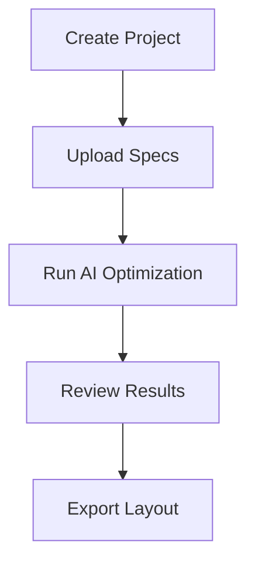

## Overview

zapRF accelerates MMIC power amplifier design by automating layout optimization with AI. You create a project, upload specifications, run the optimization, and export production-ready layouts—all in under 10 minutes.

<Callout kind="tip">
  **Prerequisites:** Sign up for a zapRF account at https://app.zaprf.com. No software installation required for web dashboard use. For CLI, install via `npm install -g @zaprf/cli`.
</Callout>



## Complete Your First Project

Follow these steps to generate an optimized layout for a 5-6 GHz GaN power amplifier.

<Steps>
  <Step title="Create Project" icon="plus">
    Log in to the zapRF dashboard.

    Click **New Project**.

    Enter project details:

    ```
    Name: PA_5GHz_v1
    Description: High-power GaN amplifier
    Target Frequency: 5-6 GHz
    ```

    Click **Create**.
  </Step>

  <Step title="Upload Specifications" icon="upload">
    Prepare your design specs as JSON.

    <Tabs>
      <Tab title="Web Upload" icon="globe">
        Drag and drop `specs.json` into the **Specifications** tab.
      </Tab>
      <Tab title="CLI" icon="terminal">
        <CodeGroup tabs="bash">
          ```bash
          zaprf project init PA_5GHz_v1
          zaprf specs upload specs.json
          ```
        </CodeGroup>
      </Tab>
    </Tabs>

    Example `specs.json`:

    ```json
    {
      "frequency_range": {
        "min_ghz": 5.0,
        "max_ghz": 6.0
      },
      "target_output_power_dbm": 30,
      "technology": "GaN",
      "matching_network": "balanced",
      "constraints": {
        "max_chip_size_mm": 4.0,
        "min_gain_db": 15
      }
    }
    ```
  </Step>

  <Step title="Run Optimization" icon="zap">
    In the project dashboard, click **Start Optimization**.

    Select options:

    | Option          | Recommended Value |
    |-----------------|-------------------|
    | Iterations      | 100               |
    | Precision       | High              |
    | Parallel Jobs   | Auto              |

    The AI process completes in 2-5 minutes. Monitor progress in real-time.
  </Step>

  <Step title="Review and Export" icon="check-circle">
    View interactive 3D layout preview.

    Check key metrics:

    - Power: `>28 dBm`
    - Gain: `>16 dB`
    - Efficiency: `>55%`

    <Expandable title="Advanced Review" default-open="false">
      Use built-in simulator to validate S-parameters. Adjust via `{tuning_params}` if needed.
    </Expandable>

    Click **Export** to download GDSII, OASIS, or Gerber files.
  </Step>
</Steps>

<Callout kind="success">
  Congratulations! Your first optimized MMIC layout is ready for EDA import.
</Callout>

## Next Steps

Explore more features to enhance your designs.

<Columns cols={3}>
  <Card title="Advanced Constraints" icon="settings" href="/docs/advanced/constraints">
    Fine-tune layout with custom rules and multi-objective optimization.
  </Card>

  <Card title="EDA Integration" icon="code" href="/docs/integration/eda">
    Direct import to Keysight ADS, Cadence Virtuoso, or Ansys HFSS.
  </Card>

  <Card title="Batch Processing" icon="layers" href="/docs/batch">
    Optimize multiple designs simultaneously via API or CLI.
  </Card>
</Columns>