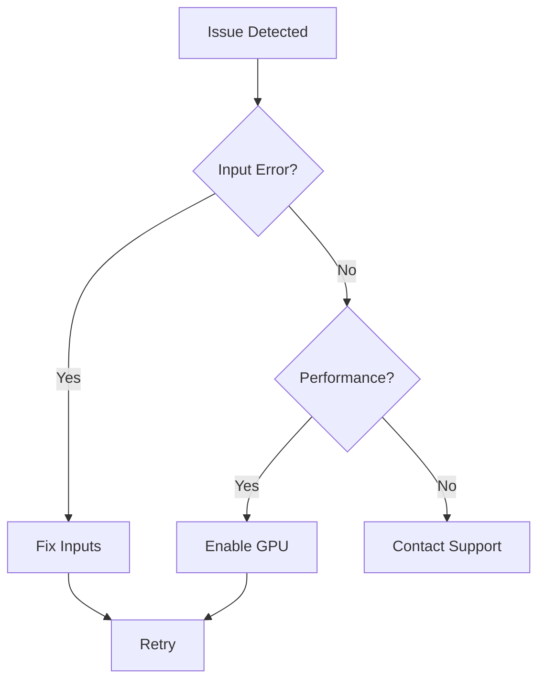

## Common Error Codes

Encounter these errors during zapRF layout generation? Use the table below to identify and fix them quickly.

| Error Code | Description | Resolution |
|------------|-------------|------------|
| ERR-001 | Invalid frequency range specified | Ensure your `frequency` input falls between `1-100` GHz. Check units. |
| ERR-002 | Missing power amplifier specs | Provide `targetPower` and `gain` in the input JSON. |
| ERR-003 | Unsupported MMIC technology | Verify `technologyNode` matches supported values like `GaAs` or `GaN`. |
| ERR-004 | Input geometry exceeds limits | Reduce `dieSize` below `5x5` mm. |

<Callout kind="tip">
  Always validate your input JSON with the schema before submitting. This prevents 90% of submission errors.
</Callout>

## Troubleshooting Workflow

Follow these steps to diagnose and resolve most issues systematically.

<Steps>
  <Step title="Verify Inputs" icon="check-circle">
    Review your JSON configuration for required fields.

    ```json
    {
      "frequency": 28,
      "targetPower": 30,
      "technologyNode": "GaN"
    }
    ```
  </Step>
  <Step title="Check Logs" icon="file-text">
    Examine console output for detailed error traces.
  </Step>
  <Step title="Test Minimal Config" icon="zap">
    Run with a basic setup to isolate the problem.

    <CodeGroup tabs="JSON,CLI">
      ```json
      {
        "frequency": 10,
        "targetPower": 20
      }
      ```
      ```bash
      zaprf generate --config minimal.json --output test.gds
      ```
    </CodeGroup>
  </Step>
  <Step title="Update zapRF" icon="download">
    Ensure you run the latest version: `npm update zaprf`.
  </Step>
</Steps>

## Optimizing Inputs for Better Results

Poor inputs lead to suboptimal layouts. Tune these parameters for improved convergence.

<Tabs>
  <Tab title="Frequency Tuning" icon="wifi">
    Set `frequency` precisely. Use a narrow band for initial runs.

    ```json
    {
      "frequency": {"min": 27.5, "max": 28.5},
      "bandwidth": 1
    }
    ```
  </Tab>
  <Tab title="Power Specs" icon="zap">
    Balance `targetPower` and `efficiency`. Start conservative.

    <Callout kind="alert">
      Values `>40` dBm may require custom cooling configs.
    </Callout>
  </Tab>
  <Tab title="Geometry Constraints" icon="square">
    Minimize `maxLayers` to `4` for faster generation.
  </Tab>
</Tabs>

## Performance and Computation Issues

Slow runs or timeouts? Apply these fixes.

<ExpandableGroup>
  <Expandable title="GPU Acceleration" default-open="true">
    Enable CUDA if available:

    ```bash
    export ZAPRF_USE_GPU=true
    zaprf generate --config advanced.json
    ```

    Expect 5x speedup on NVIDIA A100.
  </Expandable>
  <Expandable title="Memory Optimization">
    Increase allocated RAM or reduce `resolution` to `0.1um`.
  </Expandable>
</ExpandableGroup>



## Contacting Support

For persistent issues, reach out with details.

<Columns cols={2}>
  <Card title="Submit Ticket" icon="mail" href="https://zaprf.zendesk.com" target="_blank">
    Include your input JSON, logs, and error code.
  </Card>
  <Card title="Community Forum" icon="users" href="https://forum.zaprf.com" target="_blank">
    Search existing threads or post your question.
  </Card>
  <Card title="Live Chat" icon="message-circle" href="https://zaprf.com/chat" target="_blank">
    Available Mon-Fri, 9AM-5PM PST.
  </Card>
</Columns>

<Callout kind="info">
  Provide `zaprf --version`, OS details, and a minimal reproducible config to speed up resolution.
</Callout>